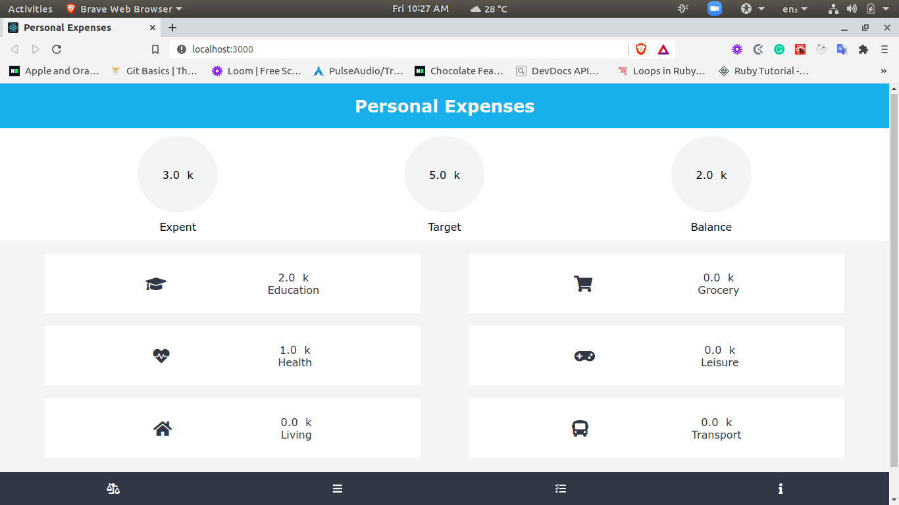

# Tracking Api

#### Welcome to your personal expenses managing APP. The purpose of this project is to help people manage your monthly expenses and achieve your personal financial goals.

#### Features
- Index all expenditures
- Create new expenditures
- Create users
- Login with a user username
- Update the user target
- Delete expenditures

#### Screenshot




#### Live Demo
- [Heroku](https://nameless-gorge-08250.herokuapp.com/)

## Built With
- [React](https://reactjs.org/)
- [Redux](https://redux.js.org/)

## Getting started

### Setup

Clone the repo with

```
  https://github.com/keneogu/track-app.git
```

Then run

```
  npm install
```

Start server with:

```
  npm start
```

### Run tests

```
  npm test
```

### Author

👤 **Kenechukwu Oguagbaka**

- GitHub: [@keneogu](https://github.com/keneogu)
- Twitter: [@keneogu](https://twitter.com/keneogu)
- LinkedIn: [@keneogu](https://www.linkedin.com/in/kene-ogu/)


### Contributing

Contributions, issues and feature requests are welcome!

Feel free to check the [issues page](https://github.com/keneogu/track-app/issues)


### Show your support

Give a star if you like this project!

### Acknowledgments

- [Microverse](https://www.microverse.org/)

### 📝 License

This project is MIT licensed.